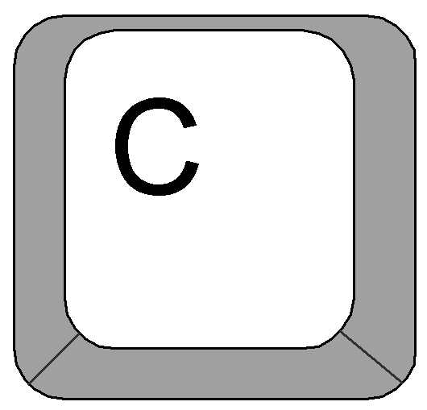

Angry Tux game
===============

Simple game for linux lovers and Windows haters. If you have some free time you can destroy some windows and
they will donate you with awesome blue screen of death. That is amazing!

Description
------------

How to run the game
--------------------

You can easily run the game after installing wiw pip using command ``AngryTux``. After run this script, new window appear and
you can start playing. User control are describe in next part.

You can chose level to play with option ``-l /level_number/``. In default there are only 2 levels, but you can create your own.

Second option what you can chose is creation factory. This change behaviour of whole game and enemies. There are two types of
facotries:

* simple - simple mode, enemies just stay at one place and moving of missiles is really simple
* realistic - realistic mode, enemies are smart (moving and teleporting) and missiles using ballistic curve for moving

Control
------

.. image:: angrytux/resources/images/letter_f.png
    :scale: 40%

.. image:: angrytux/resources/images/letter_o.png
    :scale: 40%

.. image:: angrytux/resources/images/letter_p.png
    :scale: 40%

.. image:: angrytux/resources/images/space_key_m.png
    :scale: 40%

Level creator
--------------