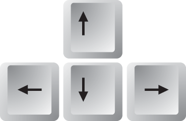

Game control
==============

Controlling  the game is really easy and intuitive. To be sure, here you have instructions.

.. |c| image:: _static/letter_c.png
    :width: 40pt

.. |o| image:: _static/letter_o.png
    :width: 40pt

.. |f| image:: _static/letter_f.png
    :width: 40pt

.. |g| image:: _static/letter_g.png
    :width: 40pt

.. |s| image:: _static/space_key_m.png
    :width: 40pt

.. |u| image:: _static/letter_u.png
    :width: 40pt

+---------+---------------------------------------------+
| |a|     | Moving of the cannon                        |
+---------+---------------------------------------------+
| |c|     | Change firing mode                          |
+---------+---------------------------------------------+
| |o|     | Lower shooting power                        |
+---------+---------------------------------------------+
| |p|     | Increase shooting power                     |
+---------+---------------------------------------------+
| |f|     | Lower gravity of game                       |
+---------+---------------------------------------------+
| |g|     | Increase gravity of game                    |
+---------+---------------------------------------------+
| |u|     | Undo command                                |
+---------+---------------------------------------------+
| |s|     | Shoot missiles                              |
+---------+---------------------------------------------+

Firing modes
-------------

Single mode
************

In single mode cannon shoot one missile in the direction of cannon. This gives you less points for hit but cost less points.

Double mode
************

In double mode cannon shoot two missiles. First missile have direction higher then cannon direction and second lower then cannon.
This cost more points but you get much more points for hitting enemies

Gravity
----------

With the keys **f** and **g** you can increase and decrease gravity. This will influence only missiles. You can use this for
smart shooting. You can kill enemies behind walls.

Shooting power
---------------

With the keys **o** and **p** you can increase and decrease shooting power. This will effect missiles starting speed.
You can combine this with gravity to achieve awesome shoots!

Undo command
---------------

This command is for undoing last command. You can undo everything what you did (shooting, destroying, etc.) You can use this for
training but don't use for competitive plays!